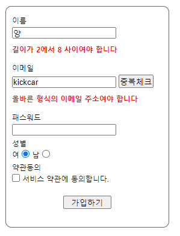
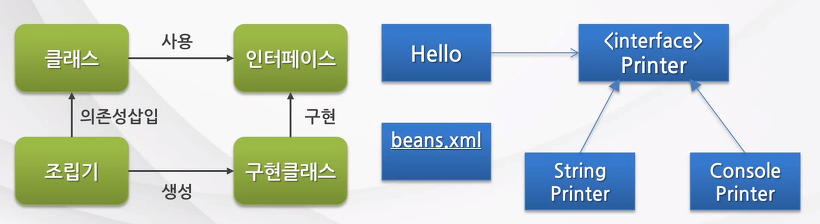
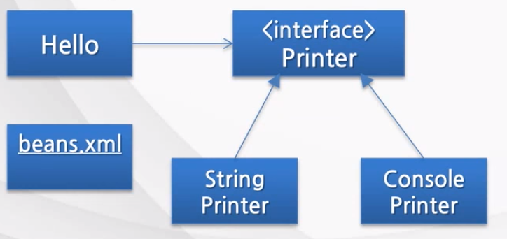
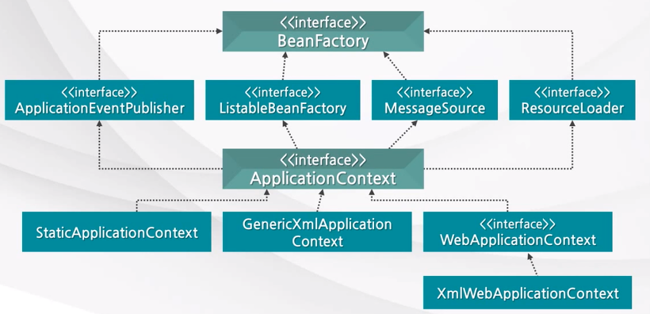

### @Valid란?

- JSR-303 표준 스펙으로써 제약 조건이 부여된 객체에 대해 빈 검증기(Bean Validator)를 이용해서 검증하도록 지시하는 어노테이션이다.

- 객체의 필드에 달린 제약조건 어노테이션을 참고해 검증을 편리하게 할 수 있다.


### **[ 다양한 제약조건 어노테이션 ]**

@AssertFalse : 거짓인가?

@Max : 지정 값 이하인가?

@AssertTrue : 참인가?

@Min : 지정 값 이상인가?

@DecimalMax : 지정 값 이하 실수인가?

@NotNull : Null이 아닌가?

@DecimalMin : 지정 값 이상 실수인가?

@Null : Null인가?

@Digits ( integer=, fraction=) : 대상 수가 지정된 정수, 소수 자리 수 이내 인가?

@Pattern(regex=, flag=) : 정규식을 만족 하는가?

@Future : 미래날짜인가?

@Past : 과거 날짜인가?

@Size(min=, max=)
: 문자열, 배열 등의 크기가 지정크기를 만족 하는가?


**hibernate-validator**

@NotEmpty : Empty 값이 아닌가?

@Email: 이메일 형식

@URL: URL 형식

@Length(min=, max=): 문자열 길이 min과 max 사이인가?

@Range(min=, max=): 숫자 범위 체크


pom.xml Dependency추가

```
		<!-- validation -->
		<dependency>
			<groupId>javax.validation</groupId>
			<artifactId>validation-api</artifactId>
			<version>1.0.0.GA</version>
		</dependency>
		<dependency>
			<groupId>org.hibernate</groupId>
			<artifactId>hibernate-validator</artifactId>
			<version>4.2.0.Final</version>
		</dependency>
```


**회원가입에서 데이터 유효성 검증**

uservo - 어노테이션 추가

```java
public class UserVo {
	private Long no;
	
	@NotEmpty
	@Length(min=2, max=8)
	private String name;
	
	@NotEmpty
	@Email
	private String email;
	
	@NotEmpty
	@Length(min=4, max=16)
	private String password;
	
```
	}
```


UserController  - join()메서드

```java
@RequestMapping(value="/join", method=RequestMethod.POST)
	public String join(@Valid UserVo vo, BindingResult result) {
		
		if(result.hasErrors()) {
			List<ObjectError> list = result.getAllErrors();
			for(ObjectError error : list) {
				System.out.println(error);
			}
		}
		//userService.join(vo);
		return "redirect:/user/joinsuccess";
	}
```

- 제약조건을 만족하지않으면 콘솔에 에러 출력


ex) 에러내용

> Field error in object 'userVo' on field 'name': rejected value []; codes [Length.userVo.name,Length.name,Length.java.lang.String,Length]; arguments [org.springframework.context.support.DefaultMessageSourceResolvable: codes [userVo.name,name]; arguments []; default message [name],8,2]; default message [길이가 2에서 8 사이여야 합니다]
> Field error in object 'userVo' on field 'password': rejected value []; codes [NotEmpty.userVo.password,NotEmpty.password,NotEmpty.java.lang.String,NotEmpty]; arguments [org.springframework.context.support.DefaultMessageSourceResolvable: codes [userVo.password,password]; arguments []; default message [password]]; default message [비어 있을 수 없습니다]
> Field error in object 'userVo' on field 'password': rejected value []; codes [Length.userVo.password,Length.password,Length.java.lang.String,Length]; arguments [org.springframework.context.support.DefaultMessageSourceResolvable: codes [userVo.password,password]; arguments []; default message [password],16,4]; default message [길이가 4에서 16 사이여야 합니다]
> Field error in object 'userVo' on field 'email': rejected value []; codes [NotEmpty.userVo.email,NotEmpty.email,NotEmpty.java.lang.String,NotEmpty]; arguments [org.springframework.context.support.DefaultMessageSourceResolvable: codes [userVo.email,email]; arguments []; default message [email]]; default message [비어 있을 수 없습니다]
> Field error in object 'userVo' on field 'name': rejected value []; codes [NotEmpty.userVo.name,NotEmpty.name,NotEmpty.java.lang.String,NotEmpty]; arguments [org.springframework.context.support.DefaultMessageSourceResolvable: codes [userVo.name,name]; arguments []; default message [name]]; default message [비어 있을 수 없습니다]


**에러메시지 출력**

jsp에서 태그라이브러리 추가

```
<%@ taglib uri="http://www.springframework.org/tags" prefix="spring" %>
```

join.jsp 에 추가

```
<spring:hasBindErrors name="userVo">
<c:if test="${errors.hasFieldErrors('name') }">
<strong>${errors.getFieldError( 'name' ).defaultMessage }</strong>
</c:if>
</spring:hasBindErrors>
```




## Spring IoC(제어역전: Inversion of Control) Container & DI(Dependency Injection)

### IoC(Inversion of Control)의 이해

**1-1 IoC의 개념**

**IoC(제어권의 역전)**이란, 객체의 생성, 생명주기의 관리까지 모든 객체에 대한 제어권이 바뀌었다는 것을 의미한다.

- 컴포넌트 의존관계 결정 (Component dependency resolution), 설정(configuration) 및 생명주기(lifecycle)를 해결하기 위한 디자인 패턴(Design Pattern)
- 

**1-2** **IoC의 컨테이너**

스프링 프레임워크도 **객체에 대한 생성 및 생명주기를 관리**할 수 있는 기능을 제공하고 있음. 즉, IoC 컨테이너 기능을 제공한다.

- IoC 컨테이너는 객체의 생성을 책임지고, 의존성을 관리한다.

- POJO의 생성, 초기화, 서비스, 소멸에 대한 권한을 가진다.

- 개발자들이 직접 POJO를 생성할 수 있지만 컨테이너에게 맡긴다.


**1-3** **IoC의 분류**
**DL(Dependency Lookup) 과 DI(Dependency Injection)**

- **DL** : 저장소에 저장되어 있는 Bean에 접근하기 위해 컨테이너가 제공하는 API를 이용하여 Bean을 Lookup 하는 것

- **DI :** 각 클래스간의 의존관계를 빈 설정(Bean Definition) 정보를 바탕으로 컨테이너가 자동으로 연결해주는 것

  - Setter Injection

  - Constructor Injection

  - Method Injection

DL 사용시 컨테이너 종속이 증가하여, 주로 DI를 사용함.


### 2.DI(Dependency Injection)의 이해

**2-1 DI의 개념**

각 클래스간의 의존관계를 빈 설정 (Bean Definition) 정보를 바탕으로 컨테이너가 자동으로 연결해주는 것을 말함.

- 개발자들은 단지 빈 설정파일에서 의존관계가 필요하다는 정보를 추가하면 된다.
- 객체 레퍼런스를 컨테이너로부터 주입 받아서, 실행 시에 동적으로 의존관계가 생성된다.
- 컨테이너가 흐름의 주체가 되어 애플리케이션 코드에 의존관계를 주입해 주는 것이다.


​	**DI 의 장점**

- 코드가 단순해진다.
- 컴퓨턴트 간의 결합도가 제거된다.


**2-2 DI의 유형**

- **Setter Injection (Setter 메서드를 이용한 의존성 삽입)** : 의존성을 입력 받는 setter 메서드를 만들고 이를 통해 의존성을 주입한다.

- **Constructor Injection (생성자를 이용한 의존성 삽입)** : 필요한 의존성을 포함하는 클래스의 생성자를 만들고 이를 통해 의존성을 주입한다.

- **Method Injection (일반 메서드를 이용한 의존성 삽입)** : 의존성을 입력 받는 일반 메서드를 만들고 이를 통해 의존성을 주입한다.


**2-3 DI를 이용한 클래스 호출방식**

Hello 클래스 사용한다는 가정하에 구현 클래스의 상위 인터페이스를 사용하며 구현 클래스의 정보는 xml(설정파일)에 기술 해놓는다. 그러면 Framework(컨테이너) 에서 설정파일을 읽은후 구현객체를 생성하며 서로 의존관계가 있는지 확인하는 작업은 컨테이너에서 실행해준다.




**2-4 Setter Injection**




### 3.Spring DI 컨테이너에 대한 이해

**3-1 Spring DI 컨테이너의 개념**

Spring DI 컨테이너가 관리하는 객체를 **빈(bean)**이라고 하고, 이 빈(bean)들을 관리한다는 의미로 컨테이너를 **빈 팩토리(BeanFactory)** 라고 부른다.

- 객체의 생성과 객체 사이의 런타임(run-time) 관계를 DI 관점에서 볼 때는 컨테이너를 **BeanFactory**라고 한다.
- BeanFactory에 여러 가지 컨테이너 기능을 추가하여 **애플리케이션 컨텍스(ApplicationContext)**라고 부름


**3-2 BeanFactory와 ApplicationContext**

**-BeanFactory**

- Bean을 등록,생성,조회,반환 관리함.

- 보통은 BeanFactory를 바로 사용하지 않고, 이를 확장한 ApplicationContext를 사용함.

- getBean() 메서드가 정의되어 있음


**- ApplicationContext**

- Bean을 등록,생성,조회,반환 관리하는 기능은 BeanFactory와 같음

- Spring의 각종 부가 서비스를 추가로 제공함

- Spring이 제공하는 ApplicationContext 구현 클래스가 여러 가지 종류가 있음



